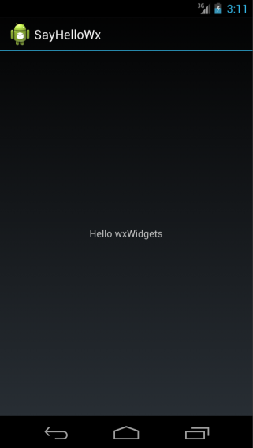

## Create minimally functional Android port.

The goal of this project would be to start a wxAndroid port, i.e. an
implementation of wxWidgets API targeting the Android OS. It is infeasible to
fully write such a port in the GSoC time frame, but we believe that a motivated
student could provide a good foundation for such port and, ideally, something
at least minimally working.

The plan is to start by implementing the low-level classes needed by all
wxWidgets applications, such as `wxApp`, `wxWindow`, `wxTopLevelWindow`,
`wxEventLoop` and a few others. Once this is done it should be possible to
use `wxGLCanvas` to write Android applications using OpenGL for their
graphics.

The next step could be to either implement more low-level classes such as the GDI
classes (`wxDC` and/or `wxGraphicsContext` and `wxBrush`, `wxPen`, `wxBitmap`
or the corresponding `wxGraphicsBrush`, `wxGraphicsPen`, `wxGraphicsBitmap`)
and use the wxUniversal port for the GUI controls, or start implementing the GUI
controls using native equivalents. In any case, the student definitely would
_not_ be expected to fully finish this part.

The exact approach used needs to be discussed as it would depend on the
qualifications -- and also interest/motivations -- of a particular student.

[**Difficulty:**](../project-ratings) 8
[**Importance:**](../project-ratings) 9

### Experience needed

Some knowledge of the Android API would be definitely useful.

### See also

* [Android developer site](http://developer.android.com/)
* [wxAndroid wiki page](http://wiki.wxwidgets.org/WxAndroid)
* [wxiOS](../ios)
